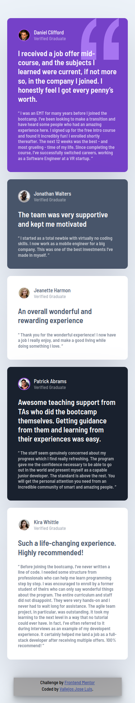
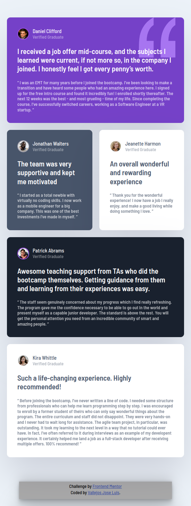
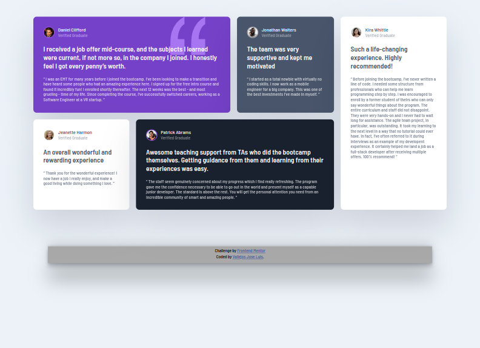

# Frontend Mentor - Testimonials grid section solution

This is a solution to the [Testimonials grid section challenge on Frontend Mentor](https://www.frontendmentor.io/challenges/testimonials-grid-section-Nnw6J7Un7). Frontend Mentor challenges help you improve your coding skills by building realistic projects.

## Table of contents

  - [The challenge](#the-challenge)
  - [Screenshot](#screenshot)
  - [Links](#links)
- [My process](#my-process)
  - [Built with](#built-with)
  - [What I learned](#what-i-learned)
  - [Continued development](#continued-development)
  - [Useful resources](#useful-resources)
- [Author](#author)
- [Acknowledgments](#acknowledgments)

### The challenge

Users should be able to:

- View the optimal layout for the site depending on their device's screen size.

### Screenshot

### Links

- Solution URL: [See my solution :eyes:](https://github.com/NikolaiKoz/FrontendMetor-testimonial-grid-section-component.github.io)
- Live Site URL: [Visit the site :eyes:](https://nikolaikoz.github.io/FrontendMetor-testimonial-grid-section-component.github.io/)

## My process

  I decided to put everything inside a section tag to create a react component in the future.

  The first thing was to create a card, finished with it, copy and paste the same code five times.

  Only the first card has an addition that is a background image of some quotes, it is inside a picture tag.

  I decided to put everything inside a section tag to create a react component in the future.

  To finish, use grid to create a grid and establish the most similar layout to the images of the design.
  - [Screenshot](#screenshot)

  Also create a version for tablets.

### Built with

- Semantic HTML5 markup
- CSS custom properties
- Flexbox
- CSS Grid
- Mobile-first workflow

### What I learned

  This was an opportunity to learn how to use grid and flexbox in the same file, there are still properties that I don't use but to be my first experiment I think it's fine.

  NOTE: there is something in the paddings or margins that doesn't make me happy, I think it's the font size, the alignment or something, but the words don't jump lines when I would like

### Continued development

  As I already said, the cards are the same code repeated 5 times, I think it could be optimized with a React component, but since I don't know React, I don't have an opinion.

### Useful resources

- [Resource 1 - Shadows](https://getcssscan.com/css-box-shadow-examples) - On this page there are many types of shadows to use.

- [Resourse 2 - General information](https://www.w3schools.com/) - Here is the information of the CSS and HTML properties that helped me to solve some conflicts that arose.

- [Resource 3 - Emojis for commits](https://gist.github.com/parmentf/035de27d6ed1dce0b36a) - Emojis for the commits :lipstick:.

## Author

- Website - [Jose Luis Vallejos](https://github.com/NikolaiKoz)
- Frontend Mentor - [@NikolaiKoz](https://www.frontendmentor.io/profile/NikolaiKoz)
- Instagram - [@joselvallejos89](https://www.instagram.com/joselvallejos89/)

## Acknowledgments

  I thank myself, I want to be a programmer and although on many occasions I was tempted to look for a solution on YouTube, I am proud to have been able to solve this challenge alone, being self-taught is not easy, there is no marked path, I have been little less than a year trying to know what I should know, in short, the hypotenuse, but I like it, the frustration of hours disappears and is replaced by the maximum joy that a human being can experience when, through his own thought and reason, he manages to center a text in a div, at that time, we are able to touch a fragment of God.
